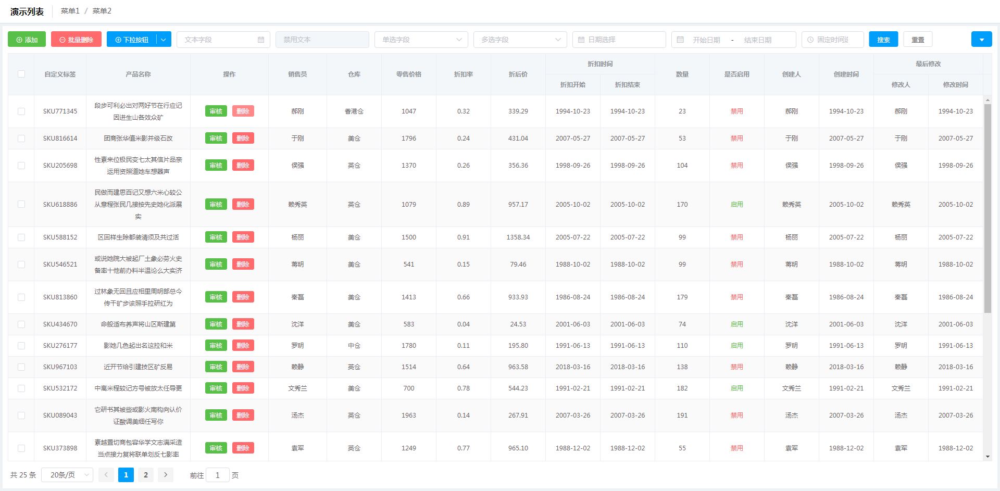

# Vue Listview

Vue Listview 为一个基于 [Vue.js](https://cn.vuejs.org/) 和 [Element-UI](http://element.eleme.io/) 的列表页面类布局组件：



## 安装

```bash
yarn add @laomao800/vue-listview@next

# OR

npm i @laomao800/vue-listview@next
```

::: tip 提示
`element-ui` 作为 peerDependencies 需要在宿主项目中独立安装。
:::

## 使用

### 局部注册

```vue
<template>
  <Listview />
</template>

<script>
import Listview from '@laomao800/vue-listview'
export default {
  components: { Listview }
}
</script>
```

### 全局注册

```js
// main.js
import Vue from 'vue'
import Listview from '@laomao800/vue-listview'
import ElementUI from 'element-ui'
import 'element-ui/lib/theme-chalk/index.css'

Vue.use(Listview)
Vue.use(ElementUI)
```

### 全局配置

通过 create 方法可对部分 props 默认值进行全局配置，并生成全新的组件。

可用于项目间接口格式不同，或者项目内部有多个不同默认布局等特殊场景。

```js
// main.js
// ...
import { create as createListview } from '@laomao800/vue-listview'

const Listview = createListview({
  validateResponse: res => res.other_success_status,
  pagePosition: 'right',
  // ...
})
Vue.use(Listview)
```

详细说明及支持配置可查看 [create](dev/create.md) 章节

### UMD

演示： [jsfiddle](https://jsfiddle.net/laomao800/92Lvg1rn/4/)

```html
<div id="app">
  <Listview />
</div>

<script src="//unpkg.com/vue/dist/vue.js"></script>
<script src="//unpkg.com/@laomao800/vue-listview/dist/listview.umd.min.js"></script>
<script>
new Vue().$mount('#app')
</script>
```

## `/dist` 文件说明

由于 Listview 内部所有基础视图组件都来自 [Element-UI](http://element.eleme.io/) ，因此打包文件分别有两个版本，以下为 `dist` 目录下文件的对比说明：

| 文件                            | 说明                                         |
| ------------------------------- | -------------------------------------------- |
| `listview-component.common.js`  | **默认文件**，只包含 listview 自身功能       |
| `listview-component.umd.js`     | 同上的 UMD 版本                              |
| `listview-component.umd.min.js` | 同上的 UMD 压缩版本                          |
| `listview.common.js`            | 包含 listview 功能和 Element-UI + css 完整库 |
| `listview.umd.js`               | 同上的 UMD 版本                              |
| `listview.umd.min.js`           | 同上的 UMD 压缩版本                          |
