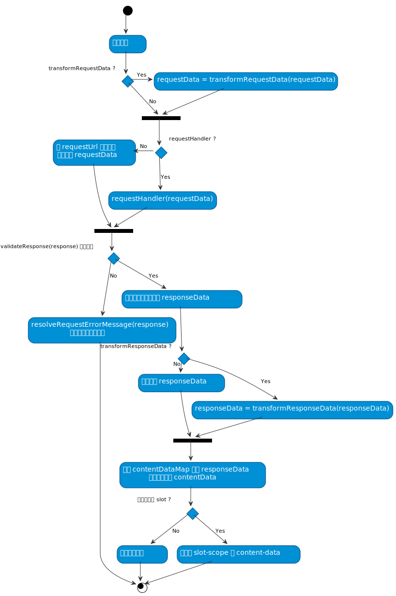

# Props

## 布局类

### headerTitle

- type: `String`
- default: `''`

设置页面顶部通栏内的页面标题文本。

### headerNav

- type: `Array`
- default: `[]`

设置页面顶部通栏内的面包屑，子项可为字符串或 object ， object 支持属性有：

| 参数   | 说明                                      |
| ------ | ----------------------------------------- |
| `text` | 显示文字                                  |
| `to`   | 可选，路由跳转对象，同 vue-router 的 `to` |

### height

- type: `[String, Number]`
- default: `null`

优先级**最高**，设置整体布局高度，包含顶部标题栏、搜索栏、正文区域、页码区域所有内容的高度，支持百分比。

### fullHeight

- type: `Boolean`
- default: `true`

垂直高度是否铺满屏幕高度。

### contentMessage

- type: `[Object, String]`
- default: `{}`

可用在 [autoload](#autoload) 为 `false` 时候，初始显示的提示信息。

如果为 `String` 类型则不带图标只显示文本。如果为 `Object` 类型则支持格式为 `{ type: '', message: '' }` ，其中 type 支持 `success` , `warning` , `info` , `error` 。

## 搜索栏

### filterButtons

- type: `Array`
- default: `[]`

搜索栏左侧按钮配置，具体可查看 [《Prop filterButtons》](prop-filter-buttons.md) 。

### filterFields

- type: `Array`
- default: `[]`

搜索栏搜索字段配置，具体可查看 [《Prop filterFields》](prop-filter-fields.md) 。

### filterModel

- type: `Object`
- default: `{}`

可选，存储搜索栏的搜索条件值。如果有需要跟随请求直接发送的数据也可在此设置，以实现类似“隐藏域”的提交效果。

::: warning 有效值过滤

注意，提交时只会对内部**有效值**进行提交，会过滤掉以下内容的参数值： `''` , `null` , `undefined` , `[]` , `{}` 。

:::

### showFilterSearch

- type: `Boolean`
- default: `true`

是否显示搜索栏的“提交”按钮。

### showFilterReset

- type: `Boolean`
- default: `true`

是否显示搜索栏的“重置”按钮。

## 分页

### usePage

- type: `Boolean | Object`
- default: `true` | `{ pageIndex: 'page_index', pageSize: 'page_size' }`

是否开启底部分页功能，传入 `Boolean` 类型，则表示功能开启与否，开启后在请求时参数上除了包含搜索栏内的数据，还会自动附加上 `page_index` 和 `page_size` 2 个参数。

如果接口的分页参数与默认的不一致，可以通过传入 `Object` 类型，指定 pageIndex 和 pageSize 2 个 key 名，相应的分页参数值会以配置好的 key 名发送。

### pageSizes

- type: `Array`
- default: `[20, 50, 100]`

分页“每页数量”可选值。

### pageSize

- type: `Number`
- default: `20`

默认每页分页数量。

### pageProps

- type: `Object`
- default: `{}`

除了 `total` 和 `currentPage` 之外的所有 `<el-pagination>` 支持的 [Props](https://element.eleme.cn/#/zh-CN/component/pagination#attributes) 。

## 表格

### tableColumns

- type: `Array`
- default: `[]`

表格列配置，具体可查看 [《Prop tableColumns》](prop-table-columns.md)。

### tableProps

- type: `Object`
- default: `{}`

可传入 [《Element-UI table#table-attributes》](http://element.eleme.io/#/zh-CN/component/table#table-attributes) 的所有属性。

内部通过 `v-bind` 绑定给 `<el-table>` 元素。

### tableEvents

- type: `Object`
- default: `{}`

可传入 [《Element-UI table#table-events》](http://element.eleme.io/#/zh-CN/component/table#table-events) 的所有支持事件。

内部通过 `v-on` 绑定给 `<el-table>` 元素。

### tableSelectionColumn <Badge text="1.2.0+" />

- type: `Boolean` | `String` | `Object`
- default: `true`

是否开启表格行选择功能。传入 `'single'` 为表格单选效果。如果需要禁用部分行的可选状态，可传入 `selectable` 属性：

```js
{
  tableSelectionColumn: {
    // 不传该属性默认为多选
    type: 'single',

    // 用法与 <el-table-column /> 的 selectable 一致，返回 false 表示当行不可选择
    selectable(row, index) {
      return index % 2 === 0
    }
  }
}
```

### tableSelection

- type: `Array`
- default: `[]`

表格行选择的选中数据。可通过 `.sync` 修饰符获取更新：

```vue
<listview :table-selection.sync="tableSelection" />
```

## 数据请求

::: tip 说明

每次发起请求会自动将 [filterModel](#filtermodel) 中的数据作为参数提交。

默认开启 `withCredentials: true` ，如需关闭请配置 [requestConfig](#requestconfig) 。

:::

### autoload

- type: `Boolean`
- default: `true`

初始化后是否自动加载第一页内容。

### requestUrl

- type: `String`
- default: `''`

数据请求接口地址。

### requestMethod

- type: `String`
- default: `post`

支持 Axios 支持的方法： `get`, `delete`, `head`, `options`, `post`, `put`, `patch` 。

### requestConfig

- type: `Object`
- default: `{}`

兼容 Axios 的所有 [`requestConfig`](https://github.com/axios/axios#request-config) 配置，除了 `cancelToken` 。

### contentDataMap

- type: `Object`
- default: `{ items: 'result.items', total: 'result.total_count' }`

数据接口响应内容属性映射。可以直接配置各属性相对于接口响应数据的取值路径来直接映射返回值。默认会有表格视图所需的 2 个属性映射 `items` （表格数据） 和 `total` 用于分页组件。

在发起请求并判断接口获取成功（[`validateResponse`](#validateresponse) 方法验证通过）后：

- 【默认表格样式】会分别在表格数据和分页组件使用 `items` 和 `total` 2 个属性。
  - `<el-table :data="contentData.items" />`
  - `<el-pagination :total="contentData.total" />`
- 【自定义 slot 】数据挂载在 slot-scope 的 `content-data` 属性上。
- **如果 `contentDataMap` 设置为 `null` ，则不进行映射处理，直接返回接口响应数据。**

例如：有接口响应为

```js
{
  is_success: true,
  errorInfos: null,
  result: {
    items: [1, 2, 3],
    total: 20
  }
}
```

通过映射表配置

```js
{
  items: 'result.items',
  total: 'result.total',
  errorInfos: 'errorInfos'
}
```

可得到：

```js
{
  items: [1, 2, 3],
  total: 20,
  errorInfos: null
}
```

## 错误处理

### validateResponse

- type: `Function`
- default:

  ```js
  function (response) {
    try {
      return response.is_success
    } catch (e) {
      return false
    }
  }
  ```

验证接口响应是否成功。若接口响应格式字段有差异，可修改该配置，如果无需错误处理可直接返回 `true` 。

### resolveResponseErrorMessage

- type: `Function`
- default:

  ```js
  function (response) {
    try {
      return response.error_info.msg
    } catch (e) {
      return '未知错误'
    }
  }
  ```

在 `validateResponse` 返回 `false` 表示请求失败后，会调用 `resolveResponseErrorMessage` 解析错误提示信息。

- 【默认表格样式】错误信息会出现在表格内容区域内
- 【自定义 slot 】数据挂载在 slot-scope 的 `content-message` 属性上。

## 数据请求 - 高级配置

如果对于数据接口请求在发送前、接受后有特殊的处理流程，或者接口数据格式与规范不一致，可通过以下几个参数对数据进行加工处理，内部处理流程为：

<!-- ./request-flow.puml -->



### requestHandler

- type: `Function(requestData)`
- default: `null`

自定义请求方法，需要返回 Promise ，该方法优先级最高，若设置了该方法，会以返回的内容交由 [`validateResponse`](#validateresponse) 进行验证，具体流程可查看上方流程图。

### transformRequestData

- type: `Function(requestData)`
- default: `null`

该方法可对接口发起请求参数在发送前作最后的更改，方法最终 return 的数据会作为提交参数。参数 `requestData` 包含搜索栏的所有数据，如果有开启分页还会包含 `page_index` 和 `page_size` 。

如果该方法显式的返回 `false` 则会阻止提交，可用于发起请求前进行参数验证等。

### transformResponseData

- type: `Function(requestData)`
- default: `null`

对原始响应数据的加工方法，接收原始响应数据，方法处理后 return 的返回值会交由给 `contentDataMap` 进行映射。

一般用于接口响应的数据无法简单一次映射到需要的数据（如需要根据条件重组、聚合）时，可使用该配置项。
